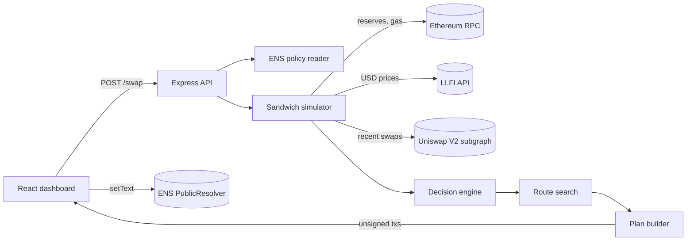

# MEV Shield

Simulates the sandwich bot before you swap, then finds the cheapest way to trade around it.

[](https://mev-shield.joshionchain.workers.dev)
[](https://github.com/CodeMongerrr/MEV-Shield/actions/workflows/ci.yml)
[](agent/tsconfig.json)
[](https://viem.sh)
[](LICENSE)
[](https://github.com/CodeMongerrr/MEV-Shield/releases)
[](https://ethglobal.com/events/hackmoney2026)

MEV Shield is a TypeScript agent and a React dashboard, built solo during [ETHGlobal HackMoney 2026](https://ethglobal.com/events/hackmoney2026). Give it a swap and it reads the live Uniswap V2 pool, replays what a sandwich bot would do to that exact trade, and prices three ways to execute it. A single public swap, a Flashbots private relay, or a hybrid that sends part of the trade privately and the rest as public chunks too small to be worth attacking. It returns the cheapest plan with every cost broken out, plus a transaction outline for each leg.

## Live demo

Open [mev-shield.joshionchain.workers.dev](https://mev-shield.joshionchain.workers.dev) and press **Analyze 250 WETH to USDT**. It reads the live Uniswap V2 pool, gas and prices, replays the sandwich bot against that trade and returns the cheapest plan in about two seconds. No wallet is needed and nothing is signed or sent.

Both parts run on Cloudflare Workers. The dashboard is a static site and the API is [mev-shield-api.joshionchain.workers.dev](https://mev-shield-api.joshionchain.workers.dev/health), a Worker that runs the same analysis code as the Node server. In browsers the API only answers the dashboard, and every visitor is rate limited. Numbers move with the chain, so each run differs a little from the sample result below.

## What it does

A large swap sitting in the public mempool gets sandwiched. A bot buys just before it, lets it push the price further, then sells right after. Routing the whole trade through a private relay avoids the bot, but in this model the builder tip needed to get included grows with the square of the trade size. MEV Shield puts a dollar figure on each option for the specific trade and pool, then picks the lowest.

### Sample result

Modeled on live Ethereum mainnet data on 29 September 2026 for a 250 WETH to USDT swap. The Uniswap V2 pool held about 2,813 WETH and 7.54M USDT, so the trade was 4.4% of pool depth.

- **Unprotected swap.** Modeled sandwich loss of $47,871, which is 7.8% of the $614,040 the trade would return without an attack.
- **Whole trade through the private relay.** $2,323 in gas and builder tip.
- **Chosen plan, with the default cap of 10 public chunks.** 50% through the private relay and the rest in 10 public chunks, for $1,310 in total modeled cost. That is 97.3% below the unprotected cost of $47,881.

These are model outputs, not executed trades. They move with pool reserves, gas and the ETH price, so a rerun gives different numbers. The exact request is in the Quickstart.

## How it works



1. **Policy.** The agent reverse resolves the user address to an ENS name and reads six `com.mevshield.*` text records with viem, falling back to defaults when none are set.
2. **Simulation.** It finds the pair through the Uniswap V2 factory, reads reserves and decimals, takes the gas price from the RPC and USD prices from LI.FI, then runs the sandwich in `bigint`. Front run, victim swap on the moved pool, back run. The attack only counts if the bot clears the gas for a 300,000 gas sandwich.
3. **History.** With a Graph API key it also pulls the pool's recent swaps from the Uniswap V2 subgraph and flags trades that lost more than the curve explains. A high sandwich rate raises the risk level.
4. **Decision.** Unprofitable attacks, low risk trades and medium risk trades under $500 go straight to a public swap. Everything else goes to the route search.
5. **Route search.** Every mix of private share and public chunk count is priced and the cheapest plan wins.
6. **Plan.** The agent builds Uniswap V2 router calldata for every public chunk, replaying each chunk against the reserves left by the one before it, and an unsigned private relay transaction when part of the trade goes private. The API returns a preview of each with truncated calldata. Nothing is signed or sent.

### The math

Swap output uses the same integer formula as `UniswapV2Library.getAmountOut`, with the 0.3% fee.

```
out = (in * 997 * reserveOut) / (reserveIn * 1000 + in * 997)
```

The bot's front run is sized from the pool and the victim input with an integer square root, and its profit is the back run proceeds minus the front run cost.

```
gR = 997 * reserveIn / 1000
gX = 997 * victimIn / 1000
frontRun = isqrt(gR * (gR + gX)) - gR
victimLoss = cleanOut - attackedOut
viable = botProfitUsd > gasPrice * 300000 * ethUsd
```

The private relay price comes from the arbitrage the trade leaves behind in a constant product pool. A searcher would pay the builder part of that arbitrage, so the user has to outbid it.

```
delta     = tradeUsd / reserveInUsd
arb       = reserveInUsd * delta^2
bid       = max(0, 0.6 * arb - 0.50) * 0.7
tip       = max(1.1 * bid, 0.10) * 0.1
relayCost = gasPrice * 180000 * ethUsd + tip
```

### Route search

The search tries a private share `p` of 0%, 10% and so on up to 100%, and for each share from 1 public chunk up to the chunk cap. The cap is the user's ENS `maxChunks` (default 10, at most 50), and never more than 100, or 20 for trades above $1M. A fully private trade has no public chunks, so the default cap gives 101 plans per trade and the largest cap gives 501. Each plan is priced as

```
cost(p, n) = relayGas + max(tip * p^2, 0.10)              private leg, when p > 0
           + sum over n chunks of (chunkMev + chunkGas)    public legs
           + tradeUsd * 0.00002 * sqrt(legs)               price drift while legs land
```

`chunkMev` is zero below the size where a sandwich stops paying for its gas, and above it scales with the square of the chunk size against an effective liquidity calibrated so the full trade reproduces the simulated loss. `chunkGas` rises slightly with each chunk to reflect priority fee competition. The cheapest of the unprotected swap, the full private relay and the best hybrid is returned, with the full breakdown.

## Quickstart

Requires Node.js 22 or newer (tested on 23.11), pnpm 9 or newer for the agent and npm for the dashboard.

```bash
git clone https://github.com/CodeMongerrr/MEV-Shield.git
cd MEV-Shield/agent
pnpm install --frozen-lockfile
cp .env.example .env        # set RPC_URL, see Configuration
pnpm dev                    # API on http://localhost:3001
```

In a second terminal, analyse a 250 WETH to USDT swap. This is the request behind the sample result.

```bash
curl -X POST http://localhost:3001/swap \
  -H "Content-Type: application/json" \
  -d '{
    "user": "0x0000000000000000000000000000000000000001",
    "tokenIn": "0xC02aaA39b223FE8D0A0e5C4F27eAD9083C756Cc2",
    "tokenOut": "0xdAC17F958D2ee523a2206206994597C13D831ec7",
    "amountIn": "250000000000000000000",
    "chainId": 1
  }'
```

Then start the dashboard.

```bash
cd MEV-Shield/frontend
npm ci                      # .npmrc sets legacy-peer-deps for RainbowKit and wagmi
cp .env.example .env.local  # point VITE_API_URL at the agent
npm run dev                 # http://localhost:5173
```

Checks that CI runs.

```bash
cd agent && pnpm typecheck && pnpm build && pnpm worker:check
cd frontend && npm ci && npm run build
```

### Run on Cloudflare Workers

The API also runs as a Cloudflare Worker. `agent/worker.ts` serves the same routes with a fetch handler and the same analysis code, and `frontend/wrangler.toml` serves the built dashboard as static assets. Both run locally without a Cloudflare account.

```bash
cd agent
cp .env.example .env        # wrangler dev reads RPC_URL from .env or .dev.vars
pnpm worker:dev             # API on http://localhost:8787

cd ../frontend
VITE_API_URL=http://localhost:8787 npm run build
npx wrangler dev --port 8788   # dashboard on http://localhost:8788
```

To deploy, set `RPC_URL` as a secret on the API Worker and run `npx wrangler deploy` in `agent`, then build the dashboard with `VITE_API_URL` set to the API Worker URL and run `npx wrangler deploy` in `frontend`. Set `ALLOWED_ORIGIN` on the API Worker to the dashboard URL.

The first `/swap` on a fresh Worker isolate uses about 40 ms of CPU and a warm one about 4 to 6 ms (measured locally on the bundled Worker). The route search itself takes about 2 ms even at 1,001 plans. The Workers Free plan allows 10 ms of CPU per request, so the first request on a fresh isolate can fail there. The Workers Paid plan allows 30 seconds by default.

### API

- `POST /swap` runs the full analysis for `{ user, tokenIn, tokenOut, amountIn, chainId }` and returns the simulation, the three way comparison, the chosen plan and a preview of each transaction.
- `GET /resolve?input=` resolves an ENS name to an address or an address to its primary name and avatar.
- `GET /policy?address=` returns the MEV Shield policy stored in that address's ENS text records.
- `GET /pool-threat?pool=` and `POST /pool-threat` scan a Uniswap V2 pool's recent swaps for sandwiches. Needs `GRAPH_API_KEY`. Without it the Worker answers 503 with a clear message.
- `GET /health` (Worker only) reports whether `RPC_URL` and `GRAPH_API_KEY` are set, without calling the RPC.

## Configuration

Agent, in `agent/.env`

- `RPC_URL` is required. An Ethereum mainnet RPC endpoint. The historical pool scan reads reserves at past blocks, which needs an archive capable endpoint.
- `GRAPH_API_KEY` is optional for `/swap` and required for `/pool-threat`. Without it the swap analysis still runs on current pool state.
- `ARBITRUM_RPC_URL` and `BASE_RPC_URL` are optional. They add L2 gas pricing and LI.FI bridge quotes to the route check.
- `PORT` is optional and defaults to 3001.

Worker only, set in the Cloudflare dashboard (`RPC_URL` and `GRAPH_API_KEY` as secrets)

- `ALLOWED_ORIGIN` is a comma separated list of origins allowed by CORS, default `*`. Browsers on other origins get a 403.
- `RATE_LIMIT_PER_MINUTE` is the per IP token bucket, default 30. `/swap` and `/pool-threat` cost 5 tokens, other routes 1, and `0` turns it off. The bucket lives in memory, so each Worker isolate keeps its own count.
- `DEBUG_LOGS` set to `1` keeps the step by step analysis logs, which are off by default to save CPU.

Dashboard, in `frontend/.env.local`

- `VITE_API_URL` is the agent URL, default `http://localhost:3001`. It is read at build time.
- `VITE_WALLETCONNECT_PROJECT_ID` is a WalletConnect project ID from Reown, used only to connect a wallet. The analysis works without a wallet.
- The older names `VITE_API_BASE` and `VITE_REOWN_PROJECT_ID` still work.
- `VITE_MAINNET_RPC_URL` is optional. It is the RPC for the dashboard's wagmi client and defaults to a public endpoint.

ENS policy keys, written from the dashboard with `PublicResolver.setText` on the current mainnet resolver

- `com.mevshield.riskProfile` is conservative, balanced or aggressive
- `com.mevshield.privateThreshold` is a USD amount
- `com.mevshield.splitEnabled` is true or false
- `com.mevshield.maxChunks` is 1 to 50
- `com.mevshield.preferredChains` is a comma separated list such as ethereum,arbitrum
- `com.mevshield.slippageTolerance` is in basis points

## Project structure

```
agent/
  index.ts                      entry point, loads .env and starts the API
  worker.ts                     Cloudflare Worker entry with the same routes, CORS and rate limit
  wrangler.toml                 Worker config for the API (mev-shield-api)
  api/
    server.ts                   Express routes for /swap, /resolve, /policy
    poolThreatRoute.ts          /pool-threat with a 5 minute cache
  core/
    agent.ts                    orchestrates policy, simulation, decision, plan
    config.ts                   viem clients for mainnet and optional L2s
    types.ts                    SwapIntent, UserPolicy, RiskLevel
  perception/
    simulator.ts                integer sandwich simulation on live reserves
    poolHistory.ts              recent swap slippage scan used inside /swap
    poolThreatAnalyzer.ts       standalone sandwich detector behind /pool-threat
    ens.ts                      ENS resolution and policy parsing with a cache
    mevTemperature.ts           pool MEV score, not called by the current pipeline
  reasoning/
    decisionEngine.ts           fast exits, then calls the route search
    calcOptimizer.ts            relay cost model and the route search
    chunkOptimizer.ts           earlier optimizer, not wired in
    dynamicOptimizer.ts         earlier optimizer, not wired in
    Optimizer.ts                earlier optimizer, not wired in
  actions/
    executor.ts                 turns a strategy into a plan
    splitter.ts                 per chunk calldata and exact chunk replay
    privateTx.ts                unsigned private relay transaction
    lifiRouter.ts               LI.FI quotes and cross chain token map
frontend/
  wrangler.toml                 Worker config that serves dist as static assets (mev-shield)
  src/config.js                 build time settings from VITE_* variables
  src/App.jsx                   swap form and results dashboard
  src/components/SetEnsPolicy.jsx   writes com.mevshield.* records on chain
  src/components/Web3Provider.jsx   RainbowKit and wagmi setup
  src/hooks/                    ENS helper hooks, currently unused
```

## Limitations

- **A planner, not an executor.** It never signs or submits anything. The private relay leg is priced by a model and the returned transaction names the Flashbots Protect RPC, but nothing is sent to it.
- **Worst case attack model.** The bot's front run is sized without the victim's slippage limit, so the unprotected loss is what a trade with no effective `amountOutMin` would suffer. Real bots are capped by that limit.
- **WETH in, dollar stablecoin out.** Input values are priced at the ETH price and the trade size is the raw output amount, so dollar figures are only right for WETH to a USD stablecoin. Other pairs run but their dollar figures are off.
- **Uniswap V2, one pool, mainnet.** Chunks are split within a single V2 pair. There is no V3 or multi venue routing, and the L2 check only flags a possible saving without changing the plan.
- **Hand set constants.** The route search prices gas at 30 times the live gas price, assumes searchers capture 60% of the arbitrage and bid 70% of that, damps the builder tip by 0.1 and charges price drift of 0.002% of the trade times the square root of the leg count. None of these are fitted to historical data.
- **Only one ENS limit is enforced.** The route search honors `maxChunks`. The other fields are shown but do not change the result yet. Without the cap, a run of the same swap a few minutes earlier picked 20% private plus 43 public chunks for $671.
- **No automated tests yet,** and the three earlier optimizer files are dead code.
- **Light protection for public hosting.** The Worker entry checks input, limits CORS to `ALLOWED_ORIGIN` and rate limits per IP, but that limit is counted per isolate, not globally. The Express server still has open CORS and no rate limit. Every `/swap` call spends RPC quota.

## Roadmap

- Enforce the remaining ENS policy fields in the route search
- Cap the bot model by the victim's slippage limit
- Price any input and output token, not only WETH to stablecoins
- Unit tests for the AMM math and the route search against fixed reserves
- Uniswap V3 pools and routing across more than one pool
- Submit private legs through Flashbots Protect or MEV Blocker behind an explicit signing step
- A global rate limit for the hosted API, for example the Cloudflare rate limiting binding
- Remove the unused optimizer versions

## License

Released under the [MIT License](LICENSE).

## Author

Built by Aditya Joshi. [GitHub](https://github.com/CodeMongerrr) and [joshionchain.com](https://www.joshionchain.com)
